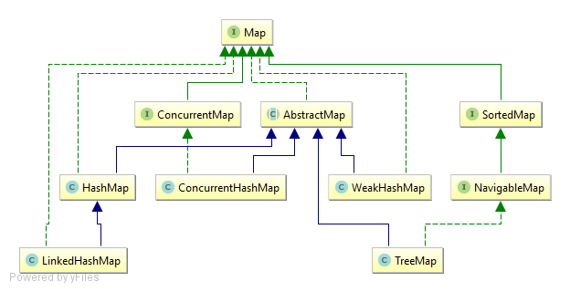

<!--
author: jimmy
head:
date: 2018-09-19
title: Map相关系统学习
tags: Map java
images: blog/img/3.jpg
category: java
status: publish
summary: Map
-->
# Map相关系统学习
<!-- @import "[TOC]" {cmd="toc" depthFrom=1 depthTo=6 orderedList=0} -->
<!-- code_chunk_output -->

* [Map相关系统学习](#map相关系统学习)
		* [Map](#map)
		* [AbstractMap](#abstractmap)
		* [TreeMap](#treemap)

<!-- /code_chunk_output -->

Map是一种用于速查找的数据结构，它以键值对的形式存储数据。
### Map
Map是JDK的一个顶级接口，提供三种集合视图：
1. keySet，包含所有key的集合
2. values，包含所有value的集合
3. entrySet，包含所有键值对的集合
集合视图就是由集合本身提供的一种访问数据的方式，同时对视图的任何修改也会影响到集合。

> Map接口规范了Map数据结构的通用API（也含有几个用于简化操作的default方法，default是JDK8的新特性，它是接口中声明的方法的默认实现，即非抽象方法）并且还在内部定义了Entry接口（键值对的实体类），在JDK中提供的所有Map数据结构都实现了Map接口



### AbstractMap
AbstractMap是一个抽象类，它是Map接口的一个骨架实现，最小化实现了此接口提供的抽象函数。在Java的Collection框架中基本都遵循了这一规定，骨架实现在接口与实现类之间构建了一层抽象，其目的是为了复用一些比较通用的函数以及方便扩展，例如List接口拥有骨架实现AbstractList、Set接口拥有骨架实现AbstractSet等。
AbstractMap实现的操作都依赖于 entrySet() 返回的集合视图，但没有提供entrySet()的实现。

### TreeMap
TreeMap 是基于红黑树事项的一个保证有序的Map。
TreeMap实现了NavigableMap接口，而该接口又继承了SortedMap接口，下面简单看下这两个接口

#### SortedMap
SortedMap接口的实现类应当按照自然排序保证key的有序性，
```
package java.util;
public interface SortedMap<K,V> extends Map<K,V> {
    /**
     * 用于在此Map中对key进行排序的比较器，如果为null，则使用key的compareTo()函数进行比较。
     */
    Comparator<? super K> comparator();
    /**
     * 返回一个key的范围为从fromKey到toKey的局部视图（包左不包右），
     * 如果fromKey和toKey是相等的，则返回一个空视图。
     * 返回的局部视图同样是此Map的集合视图，所以对它的操作是会与Map互相影响的。
     */
    SortedMap<K,V> subMap(K fromKey, K toKey);
    /**
     * 返回一个严格地小于toKey的局部视图。
     */
    SortedMap<K,V> headMap(K toKey);
    /**
     * 返回一个大于或等于fromKey的局部视图。
     */
    SortedMap<K,V> tailMap(K fromKey);
    /**
     * 返回当前Map中的第一个key（最小）。
     */
    K firstKey();
    /**
     * 返回当前Map中的最后一个key（最大）。
     */
    K lastKey();
    Set<K> keySet();
    Collection<V> values();
    Set<Map.Entry<K, V>> entrySet();
}
```

#### NavigableMap
NavigableMap 继承SortedMap 扩展了一些导航方法，实现了更灵活的操作。

### TreeMap 中的红黑树
TreeMap中的Entry代表红黑树的一个节点
```
// Red-black mechanics

    private static final boolean RED   = false;
    private static final boolean BLACK = true;

    static final class Entry<K,V> implements Map.Entry<K,V> {
        K key;
        V value;
        Entry<K,V> left;
        Entry<K,V> right;
        Entry<K,V> parent;
        boolean color = BLACK;

        /**
         * Make a new cell with given key, value, and parent, and with
         * {@code null} child links, and BLACK color.
         */
        Entry(K key, V value, Entry<K,V> parent) {
            this.key = key;
            this.value = value;
            this.parent = parent;
        }

        public K getKey() {
            return key;
        }

        public V getValue() {
            return value;
        }

        /**
         * Replaces the value currently associated with the key with the given
         * value.
         *
         * @return the value associated with the key before this method was
         *         called
         */
        public V setValue(V value) {
            V oldValue = this.value;
            this.value = value;
            return oldValue;
        }

        public boolean equals(Object o) {
            if (!(o instanceof Map.Entry))
                return false;
            Map.Entry<?,?> e = (Map.Entry<?,?>)o;

            return valEquals(key,e.getKey()) && valEquals(value,e.getValue());
        }

        public int hashCode() {
            int keyHash = (key==null ? 0 : key.hashCode());
            int valueHash = (value==null ? 0 : value.hashCode());
            return keyHash ^ valueHash;
        }

        public String toString() {
            return key + "=" + value;
        }
    }
```
