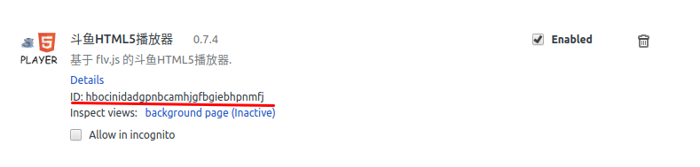

# google插件编写

<!-- @import "[TOC]" {cmd="toc" depthFrom=1 depthTo=6 orderedList=0} -->
<!-- code_chunk_output -->

* [google插件编写](#google插件编写)
	* [1 编写说明](#1-编写说明)
	* [2 开始编写](#2-开始编写)
		* [2.1 manifest.json内容](#21-manifestjson内容)
			* [2.1.1 content_scripts](#211-content_scripts)
			* [2.1.2 background](#212-background)
			* [2.1.3 event-pages](#213-event-pages)
			* [2.1.4 popup](#214-popup)
			* [2.1.5 homepage_url](#215-homepage_url)
			* [2.1.6 页面访问js inject](#216-页面访问js-inject)
			* [2.2.1 manifest中添加的五种js区别](#221-manifest中添加的五种js区别)
	* [3 注意事项](#3-注意事项)
		* [3.1 总结](#31-总结)
		* [3.2 打包](#32-打包)

<!-- /code_chunk_output -->


## 1 编写说明
Chrome插件是一个用Web技术开发、用来增强浏览器功能的软件，它其实就是一个由HTML、CSS、JS、图片等资源组成的一个.crx后缀的压缩包.也可通过c++等编写的动态链接库实现更底层的功能。<br>
google 插件编写是在闲暇时间学习，该文件记录学习过程遇到的问题。<br>
从chrome右上角菜单->更多工具->扩展程序可以进入 插件管理页面，也可以直接在地址栏输入 chrome://extensions 访问。<br>
勾选<strong> 开发者模式 </strong>可以通过文件夹加载插件，否则只能加载.crx
## 2 开始编写
插件核心是manifest.json文件，用来配置所有插件相关的配置，必须放在跟目录。
### 2.1 manifest.json内容
manifest.json基础配置如下
```
{
    // 清单文件的版本，这个必须写，而且必须是2
    "manifest_version": 2,
    // 插件的名称
    "name": "demo",
    // 插件的版本
    "version": "1.0.0",
    // 插件描述
    "description": "简单的Chrome扩展demo",
    // 图标，一般偷懒全部用一个尺寸的也没问题
    "icons":
    {
        "16": "img/icon.png",
        "48": "img/icon.png",
        "128": "img/icon.png"
    },
    // 会一直常驻的后台JS或后台页面
    "background":
    {
        // 2种指定方式，如果指定JS，那么会自动生成一个背景页
        "page": "background.html"
        //"scripts": ["js/background.js"]
    },
    // 浏览器右上角图标设置，browser_action、page_action、app必须三选一
    "browser_action":
    {
        "default_icon": "img/icon.png",
        // 图标悬停时的标题，可选
        "default_title": "这是一个示例Chrome插件",
        "default_popup": "popup.html"
    },
    // 当某些特定页面打开才显示的图标
    /*"page_action":
    {
        "default_icon": "img/icon.png",
        "default_title": "我是pageAction",
        "default_popup": "popup.html"
    },*/
    // 需要直接注入页面的JS
    "content_scripts":
    [
        {
            //"matches": ["http://*/*", "https://*/*"],
            // "<all_urls>" 表示匹配所有地址
            "matches": ["<all_urls>"],
            // 多个JS按顺序注入
            "js": ["js/jquery-1.8.3.js", "js/content-script.js"],
            // JS的注入可以随便一点，但是CSS的注意就要千万小心了，因为一不小心就可能影响全局样式
            "css": ["css/custom.css"],
            // 代码注入的时间，可选值： "document_start", "document_end", or "document_idle"，最后一个表示页面空闲时，默认document_idle
            "run_at": "document_start"
        },
        // 这里仅仅是为了演示content-script可以配置多个规则
        {
            "matches": ["*://*/*.png", "*://*/*.jpg", "*://*/*.gif", "*://*/*.bmp"],
            "js": ["js/show-image-content-size.js"]
        }
    ],
    // 权限申请
    "permissions":
    [
        "contextMenus", // 右键菜单
        "tabs", // 标签
        "notifications", // 通知
        "webRequest", // web请求
        "webRequestBlocking",
        "storage", // 插件本地存储
        "http://*/*", // 可以通过executeScript或者insertCSS访问的网站
        "https://*/*" // 可以通过executeScript或者insertCSS访问的网站
    ],
    // 普通页面能够直接访问的插件资源列表，如果不设置是无法直接访问的
    "web_accessible_resources": ["js/inject.js"],
    // 插件主页，这个很重要，不要浪费了这个免费广告位
    "homepage_url": "https://www.baidu.com",
    // 覆盖浏览器默认页面
    "chrome_url_overrides":
    {
        // 覆盖浏览器默认的新标签页
        "newtab": "newtab.html"
    },
    // Chrome40以前的插件配置页写法
    "options_page": "options.html",
    // Chrome40以后的插件配置页写法，如果2个都写，新版Chrome只认后面这一个
    "options_ui":
    {
        "page": "options.html",
        // 添加一些默认的样式，推荐使用
        "chrome_style": true
    },
    // 向地址栏注册一个关键字以提供搜索建议，只能设置一个关键字
    "omnibox": { "keyword" : "go" },
    // 默认语言
    "default_locale": "zh_CN",
    // devtools页面入口，注意只能指向一个HTML文件，不能是JS文件
    "devtools_page": "devtools.html"
}

```
#### 2.1.1 content_scripts
向页面注入脚本一种形式，可以通过配置向页面注入js与css
content_scripts和原始页面共享dom，但不共享js，要访问js变量，只能通过injected js实现。

content_scripts只能访问下面chrome api
> chrome.extension(getURL , inIncognitoContext , lastError , onRequest , sendRequest)
> chrome.i18n
> chrome.runtime(connect , getManifest , getURL , id , onConnect , onMessage , sendMessage)
> chrome.storage

#### 2.1.2 background
background是一个常驻页面，是插件中生命周期最长，随着浏览器打开关闭而打开关闭，需要一直运行的代码放在background。
background可以调用所有chrome扩展API，可以跨域访问所有外部任何网站。

#### 2.1.3 event-pages
event-pages为解决background一直后台运行的资源消耗问题，它比background多一项persistent配置。它只在需要时加载，空闲时自动关闭。
```
{
    "background":
    {
        "scripts": ["event-page.js"],
        "persistent": false
    }
}
```

#### 2.1.4 popup
popup是点击图标打开的html页面，会自适应大小，配置如下：
```
{
    "browser_action":
    {
        "default_icon": "img/icon.png",
        // 图标悬停时的标题，可选
        "default_title": "这是一个示例Chrome插件",
        "default_popup": "popup.html"
    }
}
```

#### 2.1.5 homepage_url
开发者或插件主页

#### 2.1.6 页面访问js inject
content_scripts添加的js在dom中不能访问，需在页面添加相应配置
```
{
    // 普通页面能够直接访问的插件资源列表，如果不设置是无法直接访问的
    "web_accessible_resources": ["js/inject.js"],
}
```

#### 2.2.1 manifest中添加的五种js区别
权限
| js种类 | 可访问的API | dom访问情况 | 页面js访问情况 | 能否直接跨域 |
| :----- |  :----- | :----- | :----- | :----- |
| injected script |	和普通JS无任何差别，不能访问任何扩展API | 可以访问 | 可以访问 | 不可以|
| content script | 只能访问 extension、runtime等部分API |	可以访问 | 不可以 | 不可以 |
| popup js | 可访问绝大部分API，除了devtools系列 | 不可直接访问 | 不可以 |	可以 |
| background js |	可访问绝大部分API，除了devtools系列	| 不可直接访问 | 不可以 | 可以 |
| devtools js |	只能访问 devtools、extension、runtime等部分API | 可以 | 可以 | 不可以 |

## 3 注意事项
### 3.1 总结
已安装插件源码位置
>ubuntu已安装的插件位置 **/home/usename/.config/google-chrome/Default/Extensions**, 文件夹名为插件id
>插件id在 <a href="chrome://extensions">chrome://extensions</a> 页面勾选开发者模式可见，如下图片所示




### 3.2 打包
在 <a href="chrome://extensions">chrome://extensions</a> 页面选择Pack extensions打包即可打包成.crx文件


TODO **2017-11-13 学习插件基本内容，深层开发学习以后深入**
