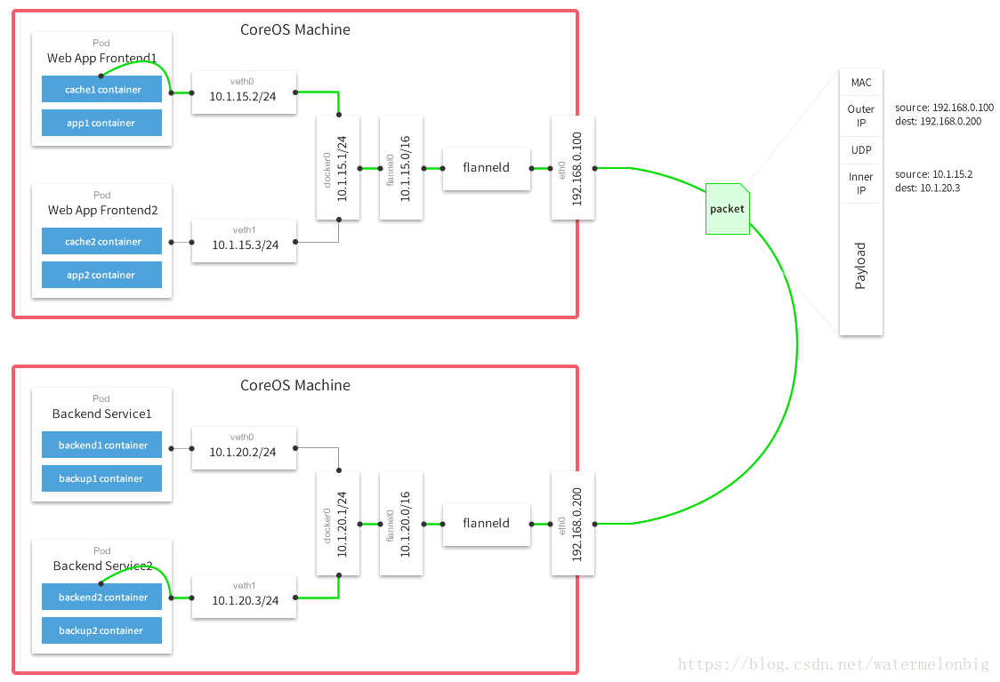
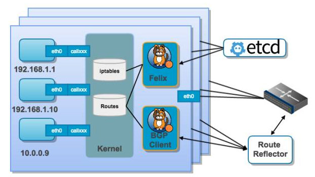
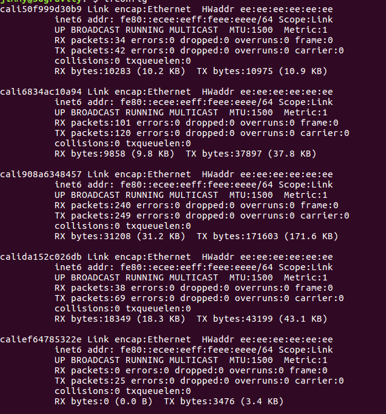
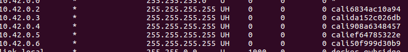

<!-- @import "[TOC]" {cmd="toc" depthFrom=1 depthTo=6 orderedList=0} -->
<!-- code_chunk_output -->

* [1. kubernetes网络介绍](#1-kubernetes网络介绍)
		* [1.1 目的](#11-目的)
		* [1.2 基础模块](#12-基础模块)
		* [1.3 通信方式](#13-通信方式)
* [2 kubernates网络组件](#2-kubernates网络组件)

<!-- /code_chunk_output -->
## 1. kubernetes网络介绍
#### 1.1 目的
Kubernetes是Google开源的一个容器编排引擎，它支持自动化部署、大规模可伸缩、应用容器化管理。研究目的为实现网关服务的持续集成、一键化部署与服务的弹性伸缩，从代码版本更新到最终上线实现自动化，根据业务需求和策略,自动调整节点数量。
#### 1.2 基础模块

Container：容器
Pod：K8s最小的调度单位，内部容器的逻辑宿主机，一个Pod可以包含多个容器，同一个Pod里的容器共享网络和文件系统。
Lable：标签，标记对象（如Pod，Service，Node），我们就可以通过Label Selector来引用这些对象。
Service：一组提供相同服务的Pod对外的访问接口，实现Pod服务发现和负载均衡。。
Node：物理机

#### 1.3 通信方式
1. 同一Pod内的网络通信。在同一个Pod内的容器共享同一个网络命名空间，共享同一个Linux协议栈。所以对于网络的各类操作，就和它们在同一台机器上一样，它们可以用localhost地址直接访问彼此的端口。其实这和传统的一组普通程序运行的环境是完全一样的，传统的程序不需要针对网络做特别的修改就可以移植了。
2. Pod1到Pod2的网络，分两种情况。Pod1与Pod2不在同一台主机与Pod1与Pod2在同一台主机。
先说Pod1与Pod2不在同一台主机。Pod的地址是与docker0在同一个网段的，但docker0网段与宿主机网卡是两个完全不同的IP网段，并且不同Node之间的通信只能通过宿主机的物理网卡进行。将Pod的IP和所在Node的IP关联起来，通过这个关联让Pod可以互相访问。
Pod1与Pod2在同一台主机。Pod1和Pod2在同一台主机的话，由Docker0网桥直接转发请求到Pod2，不需要经过网络组件。
3. Pod到Service的网络。创建一个Service时，相应会创建一个指向这个Service的域名，域名规则为{服务名}.{namespace}.svc.{集群名称}。之前Service IP的转发由iptables和kube-proxy负责，目前基于性能考虑，全部为iptables维护和转发。iptables则由kubelet维护。Service仅支持UDP和TCP协议，所以像ping的ICMP协议是用不了的，所以无法ping通Service IP。
4. Pod到外网。Pod向外网发送请求，查找路由表, 转发数据包到宿主机的网卡，宿主网卡完成路由选择后，iptables执行Masquerade，把源IP更改为宿主网卡的IP，然后向外网服务器发送请求。
5. 集群外部访问Pod或Service
由于Pod和Service是Kubernetes集群范围内的虚拟概念，所以集群外的客户端系统无法通过Pod的IP地址或者Service的虚拟IP地址和虚拟端口号访问到它们。为了让外部客户端可以访问这些服务，可以将Pod或Service的端口号映射到宿主机，以使得客户端应用能够通过物理机访问容器应用。
## 2 kubernates网络组件
网络组件主要解决集群内不同主机Pod之间的通信问题
1. Flannel
Flannel实现了对Kubernetes网络的支持，但是它引入了多个网络组件，在网络通信时需要转到flannel0网络接口，再转到用户态的flanneld程序，到对端后还需要走这个过程的反过程，所以也会引入一些网络的时延损耗。另外Flannel默认的底层通信协议是UDP。UDP本身是非可靠协议，虽然两端的TCP实现了可靠传输，但在大流量、高并发应用场景下还需要反复调试，确保不会出现传输质量的问题。特别是对网络依赖重的应用，需要评估对业务的影响。

Flannel首先创建了一个名为flannel0的网桥，而且这个网桥的一端连接docker0的网桥，另一端连接一个名为flannelId的服务进程。数据从源容器发出，经过docker0转发到flannel0，然后转发到flannelId，flannelId维护了一张节点间的路由表，flannelId服务将原本的内容封装通过主机的网卡转发到目标地址，目标主机的flannelId服务进行解包后发送到docker0,最后到目标容器

2. Calico

1. Calico是一个纯3层的数据中心网络方案，而且无缝集成像OpenStack这种IaaS云架构，能够提供可控的VM、容器、裸机之间的IP通信。Calico不使用重叠网络比如flannel和libnetwork重叠网络驱动，它是一个纯三层的方法，使用虚拟路由代替虚拟交换，每一台虚拟路由通过BGP协议传播可达信息（路由）到剩余数据中心。
2. Calico在每一个计算节点利用Linux Kernel实现了一个高效的vRouter来负责数据转发，而每个vRouter通过BGP协议负责把自己上运行的workload的路由信息像整个Calico网络内传播——小规模部署可以直接互联，大规模下可通过指定的BGP route reflector来完成。
3. Calico节点组网可以直接利用数据中心的网络结构（无论是L2或者L3），不需要额外的NAT，隧道或者Overlay Network。
4. Calico基于iptables还提供了丰富而灵活的网络Policy，保证通过各个节点上的ACLs来提供Workload的多租户隔离、安全组以及其他可达性限制等功能。
Calico是通过修改每个主机节点上的iptables和路由表规则，实现容器间数据路由和访问控制。
启动calico 可以看到其为每个容器都分配了个虚拟的网卡

在路由表中将该容器ip与网卡绑定

3. Canal
| 方案 | 优势 | 劣势 |
| :------------- | :------------- | :------------- |
| Flannel | 部署简单 | 需要封包拆包，性能较低；对docker启动方式有依赖(启动时指定该容器ip)，不支持网络策略 |
| Calico | 性能较高，可扩展性强 | 没有加密数据，仅支持TCP、UDP、ICMP、ICMPv6协议 |

Canal是flannel以及calico的综合产物，网络策略功能由calico提供，网络功能由flannel提供。
