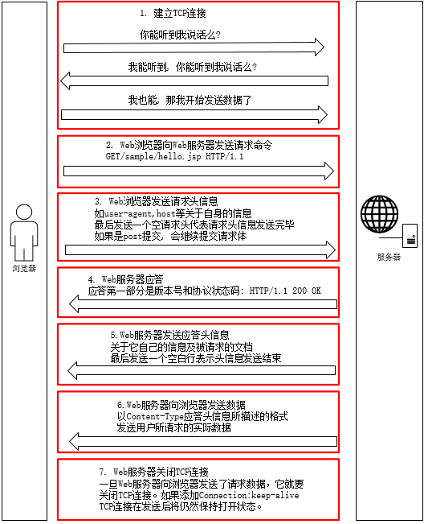
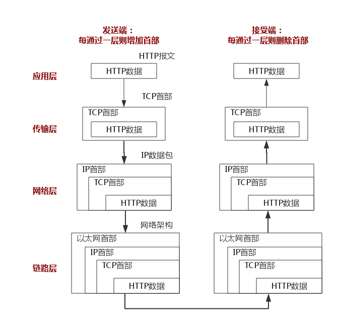

<!--
author: jimmy
head:
date: 2017-12-24
title: 问题记录
tags: ThreadLocal java
images: blog/img/3.jpg
category: java
status: publish
summary: ThreadLocal
-->

### InputStream、OutputStream 使用了什么设计模式
装饰器模式与适配器模式

### Stream Buffer区别
所有的io设备都可以被分为流设备和块设备,块设备指的是把数据打包成块进行传输,传输基本单位为块,传输过程中需要缓冲区(buffer)支持,当然,读写也是以块作为基本单位.对于流设备(也称为字符设备),传输过程是以字节流形式进行的,这样的设备是不需要缓冲机制的.
流io一般速度低于块io，并不是绝对，拿水龙头来比喻：流就像水龙头滴水，每次只有一滴；块就像水龙头往水壶放水，放满之后对一整个水壶的水进行操作。
1. 针对一段固定大小的数据 n byte，流是对每一个字节进行读取，每次读取调用一次系统函数，所以是需要n次调用。而块则是一次一块，假设块大小为b因此系统函数调用的次数为[n/b]+1，特别是当数据比较大时，效率更高
2. 流io为阻塞模式,而块io支持非阻塞(不考虑消息轮询);多线程情况下，把文件看成一个块数组的话,我们可以多线程对不同的块进行操作，比如thread1 操作块1，thread2操作块2...而对于流，由于流只能顺序读取，因此基本没有优势。
3. 在数据的实时性要求比较严的情况下，流就很方便了，每次写入一个字节系统就能立即将数据传输给程序，而块则是等到缓冲区满或者flush之后才进行处理
4. 处理数据方面，我们可以非常方便的节为流式数据创建过滤器非常容易。链接几个过滤器，以便每个过滤器只负责单个复杂处理机制的一部分。而对于一整块的数据处理起来相对就麻烦了。
5. 占用内存：由于流面向字节，一次只需要少量内存即可，而面向快由于需要缓冲区的协助，因此内存的大小与块的大小以及数量直接相关，即使块中数据并没有填满，仍然需要占用这么多内存。

### 带返回多线程 callable 与runnable
相同点：
两者都可用来编写多线程程序；
两者都需要调用Thread.start()启动线程；

不同点：
两者最大的不同点是：实现Callable接口的任务线程能返回执行结果；而实现Runnable接口的任务线程不能返回结果；
Callable接口的call()方法允许抛出异常；而Runnable接口的run()方法的异常只能在内部消化，不能继续上抛；

注意点：
Callable接口支持返回执行结果，此时需要调用FutureTask.get()方法实现，此方法会阻塞主线程直到获取‘将来’结果；当不调用此方法时，主线程不会阻塞！

### java 迭代器移除元素
在遍历数组和集合时，不能用foreach边迭代边删除，必须显示写出迭代器对象，否则会报错java.util.ConcurrentModificationException
在使用Iterator的时候，迭代器会新建一个线程，把原来的线程中的对象重新拷贝一份，在进行删除，修改等操作时，原来的线程只负责迭代，而Iterator负责迭代和删除操作，Iterator每次迭代都会检查迭代器里的对象和原线程中的对象个数是否一致，不一致则抛出：ConcurrentModificationException。
解决办法：不使用集合的remove方法，使用iterrator的remove。

### map 迭代使用什么
1. 二次取值
2. Iterator迭代器循环Map.entrySet().iterator()
3. Map.Entry 遍历---->效率高
4. Map.values()取值

### java i++ 是原子操作吗、volatile原理
1. 为什么会产生错误的数据？
多线程引起的，因为对于多线程同时操作一个整型变量在大并发操作的情况下无法做到同步，而Atomic提供了很多针对此类线程安全问题的解决方案，因此解决了同时读写操作的问题。
2. 为什么会造成同步问题？
Java多线程在对变量进行操作的时候，实际上是每个线程会单独分配一个针对i值的拷贝(独立内存区域)，但是申明的i值确是在主内存区域中，当对i值修改完毕后，线程会将自己内存区域块中的i值拷贝到主内存区域中，因此有可能每个线程拿到的i值是不一样的，从而出现了同步问题。
3. 为什么使用volatile修饰integer变量后，还是不行？
因为volatile仅仅只是解决了存储的问题，即i值只是保留在了一个内存区域中，但是i++这个操作，涉及到获取i值、修改i值、存储i值(i=i+1)，这里的volatile只是解决了存储i值得问题，至于获取和修改i值，确是没有做到同步。
4. 既然不能做到同步，那为什么还要用volatile这种修饰符？
主要的一个原因是方便，因为只需添加一个修饰符即可，而无需做对象加锁、解锁这么麻烦的操作。但是本人不推荐使用这种机制，因为比较容易出问题(脏数据)，而且也保证不了同步。
5. 那到底如何解决这样的问题？
第一种：采用同步synchronized解决，这样虽然解决了问题，但是也降低了系统的性能。
第二种：采用原子性数据Atomic变量，这是从JDK1.5开始才存在的针对原子性的解决方案，这种方案也是目前比较好的解决方案了。
6. Atomic的实现基本原理？
首先Atomic中的变量是申明为了volatile变量的，这样就保证的变量的存储和读取是一致的，都是来自同一个内存块，然后Atomic提供了getAndIncrement方法，该方法对变量的++操作进行了封装，并提供了compareAndSet方法，来完成对单个变量的加锁和解锁操作，方法中用到了一个UnSafe的对象，现在还不知道这个UnSafe的工作原理(似乎没有公开源代码)。Atomic虽然解决了同步的问题，但是性能上面还是会有所损失，不过影响不大，网上有针对这方面的测试，大概50million的操作对比是250ms : 850ms，对于大部分的高性能应用，应该还是够的了。

### threshold 详解
### java锁
1. synchronized
如果一个代码块被synchronized修饰了，当一个线程获取了对应的锁，并执行该代码块时，其他线程便只能一直等待，等待获取锁的线程释放锁，而这里获取锁的线程释放锁只会有两种情况：
　　1）获取锁的线程执行完了该代码块，然后线程释放对锁的占有；
　　2）线程执行发生异常，此时JVM会让线程自动释放锁。

2. Lock


synchronized与Lock区别
+ Lock不是Java语言内置的，synchronized是Java语言的关键字，因此是内置特性。Lock是一个类，通过这个类可以实现同步访问；

+ Lock和synchronized有一点非常大的不同，采用synchronized不需要用户去手动释放锁，当synchronized方法或者synchronized代码块执行完之后，系统会自动让线程释放对锁的占用；而Lock则必须要用户去手动释放锁，如果没有主动释放锁，就有可能导致出现死锁现象。

### redis 数据结构
string
hash
list
set
### 线程池中线程处于什么线程什么阶段
### dubbo中线程池
### GC
### 一致性hash算法
一致性hash算法是一种分布式哈希（DHT）实现算法，设计目标是为了解决因特网中的热点(Hot spot)问题，初衷和CARP十分类似。一致性哈希修正了CARP使用的简单哈希算法带来的问题，使得分布式哈希（DHT）可以在P2P环境中真正得到应用。
### 循环数组
### blockingQueue
### 一次完整的http请求过程
一次完整的HTTP请求过程从TCP三次握手建立连接成功后开始，客户端按照指定的格式开始向服务端发送HTTP请求，服务端接收请求后，解析HTTP请求，处理完业务逻辑，最后返回一个HTTP的响应给客户端，HTTP的响应内容同样有标准的格式。请求过程如下所示：





http是一个基于请求与响应，无状态的，应用层的协议，常基于TCP/IP协议传输数据。
+ 请求与相应：客户端发送请求，服务器端响应数据
+ 无状态的：协议对于事务处理没有记忆能力，客户端第一次与服务器建立连接发送请求时需要进行一系列的安全认证匹配等，因此增加页面等待时间，当客户端向服务器端发送请求，服务器端响应完毕后，两者断开连接，也不保存连接状态。下一次客户端向同样的服务器发送请求时，由于他们之前已经遗忘了彼此，所以需要重新建立连接。
+ 应用层：Http是应用层协议，配合TCP/IP使用。
+ TCP/IP：Http使用TCP作为它的支撑运输协议。HTTP客户机发起一个与服务器的TCP连接，一旦连接建立，浏览器（客户机）和服务器进程就可以通过套接字接口访问TCP。

针对无状态的一些解决策略：
> 有时需要对用户之前的HTTP通信状态进行保存，比如执行一次登陆操作，在30分钟内所有的请求都不需要再次登陆。于是引入了Cookie技术。
> HTTP/1.1想出了持久连接（HTTP keep-alive）方法。其特点是，只要任意一端没有明确提出断开连接，则保持TCP连接状态，在请求首部字段中的Connection: keep-alive即为表明使用了持久连接。

1. Http请求报文
Http请求报文由请求行（request line）、请求头部（header）、空行和请求数据4个部分组成。
+ 请求行
请求分为三个部分：请求方法、请求地址和协议版本。
```
GET /index.html HTTP/1.1
```

+ 请求头部
请求头为请求报文添加附加信息，部分请求头说明如下：

| 请求头 | 说明 |
| :------------- | :------------- |
| host | 请求服务器地址，ip端口或域名 |
| User-Agent | 发送请求的应用程序名 |
| Accept-Charset | 通知服务器可以发送的编码格式 |
| Accept-Encoding | 通知服务器发送的数据压缩格式 |

+ 空行
请求头部后会有个空行，表示请求头部结束，接下来为请求数据。

+ 请求数据
可选部分，请求数据

2. Http响应报文
HTTP响应报文主要由状态行、响应头部、空行以及响应数据组成。

+ 状态行
分为三个部分：协议版本、状态码、状态码描述。
协议版本与请求报文一致，状态码描述是对状态码的简单描述。

+ 响应头部
与请求头部类似，为响应报文添加一些附加信息；
+ 空行
表示响应头部结束；
+ 响应数据
存放返回给客户端数据。

3. TCP四次分手
当三次握手建立TCP连接后，当数据传输完成，断开连接，有了四次分手

为什么要四次分手
> TCP协议是一种面向连接的、可靠的、基于字节流的运输层通信协议。TCP是全双工模式，这就意味着，当主机1发出FIN报文段时，只是表示主机1已经没有数据要发送了，主机1告诉主机2，它的数据已经全部发送完毕了；但是，这个时候主机1还是可以接受来自主机2的数据；当主机2返回ACK报文段时，表示它已经知道主机1没有数据发送了，但是主机2还是可以发送数据到主机1的；当主机2也发送了FIN报文段时，这个时候就表示主机2也没有数据要发送了，就会告诉主机1，我也没有数据要发送了，之后彼此就会愉快的中断这次TCP连接。

### 新建对象方式
1. new
2. 反射
3. 反序列化
4. clone

### 多个线程共享数据

### spring事务
事务是作为单个逻辑工作单元执行的一系列操作。

Spring使用声明式事务处理，默认情况下，如果被注解的数据库操作方法中发生了unchecked异常，所有的数据库操作将rollback；如果发生的异常是checked异常，默认情况下数据库操作还是会提交的。
+ checked异常：
表示无效，不是程序中可以预测的。比如无效的用户输入，文件不存在，网络或者数据库链接错误。这些都是外在的原因，都不是程序内部可以控制的。
必须在代码中显式地处理。比如try-catch块处理，或者给所在的方法加上throws说明，将异常抛到调用栈的上一层。
继承自java.lang.Exception（java.lang.RuntimeException除外）。

+ unchecked异常：
表示错误，程序的逻辑错误。是RuntimeException的子类，比如IllegalArgumentException, NullPointerException和IllegalStateException。
不需要在代码中显式地捕获unchecked异常做处理。
继承自java.lang.RuntimeException（而java.lang.RuntimeException继承自java.lang.Exception）。

1. 在需要事务管理的地方加Transactional 注解。Transactional 注解可以被应用于接口定义和接口方法、类定义和类的 public 方法上。
2. Transactional 注解只能应用到 public 可见度的方法上。 如果你在 protected、private 或者 package-visible 的方法上使用 Transactional 注解，它也不会报错， 但是这个被注解的方法将不会展示已配置的事务设置。
3. 注意仅仅 Transactional 注解的出现不足于开启事务行为，它仅仅 是一种元数据。必须在配置文件中使用配置元素，才真正开启了事务行为。
4. 通过 元素的 “proxy-target-class” 属性值来控制是基于接口的还是基于类的代理被创建。如果 “proxy-target-class” 属值被设置为 “true”，那么基于类的代理将起作用（这时需要CGLIB库cglib.jar在CLASSPATH中）。如果 “proxy-target-class” 属值被设置为 “false” 或者这个属性被省略，那么标准的JDK基于接口的代理将起作用。
5. Spring团队建议在具体的类（或类的方法）上使用 Transactional 注解，而不要使用在类所要实现的任何接口上。在接口上使用 Transactional 注解，只能当你设置了基于接口的代理时它才生效。因为注解是 不能继承 的，这就意味着如果正在使用基于类的代理时，那么事务的设置将不能被基于类的代理所识别，而且对象也将不会被事务代理所包装。
6. Transactional 的事务开启 ，或者是基于接口的 或者是基于类的代理被创建。所以在同一个类中一个方法调用另一个方法有事务的方法，事务是不会起作用的。

**传播行为**

事务的第一个方面是传播行为。当事务方法被您一个事务方法调时，必须指定事务应该如何传播。
| 传播行为 | 含义 |
| :------------- | :------------- |
| PROPAGATION_REQUIRED | 表示当前方法必须运行在事务中。如果当前事务存在，方法将会在该事务中运行。否则，会启动一个新的事务 |
| PROPAGATION_SUPPORTS | 表示当前方法不需要事务上下文，但是如果存在当前事务的话，那么该方法会在这个事务中运行 |
| PROPAGATION_MANDATORY | 表示该方法必须在事务中运行，如果当前事务不存在，则会抛出一个异常 |
| PROPAGATION_REQUIRED_NEW | 表示当前方法必须运行在它自己的事务中。一个新的事务将被启动。如果存在当前事务，在该方法执行期间，当前事务会被挂起。如果使用JTATransactionManager的话，则需要访问TransactionManager |
| PROPAGATION_NOT_SUPPORTED | 表示该方法不应该运行在事务中。如果存在当前事务，在该方法运行期间，当前事务将被挂起。如果使用JTATransactionManager的话，则需要访问TransactionManager |
| PROPAGATION_NEVER | 表示当前方法不应该运行在事务上下文中。如果当前正有一个事务在运行，则会抛出异常 |
| PROPAGATION_NESTED | 表示如果当前已经存在一个事务，那么该方法将会在嵌套事务中运行。嵌套的事务可以独立于当前事务进行单独地提交或回滚。如果当前事务不存在，那么其行为与PROPAGATION_REQUIRED一样。注意各厂商对这种传播行为的支持是有所差异的。可以参考资源管理器的文档来确认它们是否支持嵌套事务 |

**隔离级别**
隔离级别定义一个事务可能受其他并发事务影响的程度。

> 并发事件引起的问题
> + 脏读
>一个事务读取另一个事务改写但未提交的数据，如果改写被回滚，读取的数据就是无效的
> + 不可重复读
> 不可重复读发生在一个事务执行两次相同的查询，但每次得到不同的数据，这通常是另一个并发事务在两次查询期间进行了更新。
> + 幻读
> 发生在一个事务读取数据后，另一个并发事务插入了一些数据。在随后的查询中，第一个事务发现多了一些原本不存在的事务。
>
> 不可重复读强调的是修改，同一条数据两次结果不同；幻读重点是新增或删除，数据条数发生变化。

| 隔离级别 | 含义 |
| :------------- | :------------- |
| SOLATION_DEFAULT | 使用后端数据库默认的隔离级别 |
| ISOLATION_READ_UNCOMMITTED | 最低的隔离级别，允许读取尚未提交的数据变更，可能会导致脏读、幻读或不可重复读 |
| ISOLATION_READ_COMMITTED | 允许读取并发事务已经提交的数据，可以阻止脏读，但是幻读或不可重复读仍有可能发生 |
| ISOLATION_REPEATABLE_READ | 对同一字段的多次读取结果都是一致的，除非数据是被本身事务自己所修改，可以阻止脏读和不可重复读，但幻读仍有可能发生 |
| ISOLATION_SERIALIZABLE | 最高的隔离级别，完全服从ACID的隔离级别，确保阻止脏读、不可重复读以及幻读，也是最慢的事务隔离级别，因为它通常是通过完全锁定事务相关的数据库表来实现的 |

### 多线程应用场景
### rabbitMQ特性
### 数据库设计
+ 范式
为设计结构合理的数据库，设计数据必须遵循一定规则。在关系型数据库中这种规则被成为范式。
1. 第一范式
第一范式是最基本范式，数据库中所有字段都是不可分割的原子值。
2. 第二范式
第二范式需要确保数据库表中的每一列都和主键相关，而不能只与主键的某一部分相关。即每张表中只能保存一种数据，不可把多种数据保存到一张表中。（可能间接相关）
3. 第三范式
每个属性都跟主键有直接关系，而不是间接关系。a->b->c 是不符合的

+ 数据引擎区别
Innodb引擎
Innodb引擎提供了对数据库ACID事务的支持，并且实现了SQL标准的四种隔离级别。该引擎还提供了行级锁和外键约束，它的设计目标是处理大容量数据库系统，它本身其实就是基于MySQL后台的完整数据库系统，MySQL运行时Innodb会在内存中建立缓冲池，用于缓冲数据和索引。但是该引擎不支持FULLTEXT类型的索引，而且它没有保存表的行数，当SELECT COUNT(*) FROM TABLE时需要扫描全表。当需要使用数据库事务时，该引擎当然是首选。由于锁的粒度更小，写操作不会锁定全表，所以在并发较高时，使用Innodb引擎会提升效率。但是使用行级锁也不是绝对的，如果在执行一个SQL语句时MySQL不能确定要扫描的范围，InnoDB表同样会锁全表。
MyIASM引擎
MyIASM是MySQL默认的引擎，但是它没有提供对数据库事务的支持，也不支持行级锁和外键，因此当INSERT(插入)或UPDATE(更新)数据时即写操作需要锁定整个表，效率便会低一些。不过和Innodb不同，MyIASM中存储了表的行数，于是SELECT COUNT(*) FROM TABLE时只需要直接读取已经保存好的值而不需要进行全表扫描。如果表的读操作远远多于写操作且不需要数据库事务的支持，那么MyIASM也是很好的选择。
>主要区别：
> 1. MyIASM是非事务安全的，而InnoDB是事务安全的
> 2. MyIASM锁的粒度是表级的，而InnoDB支持行级锁
> 3. MyIASM支持全文类型索引，而InnoDB不支持全文索引
> 4. MyIASM相对简单，效率上要优于InnoDB，小型应用可以考虑使用MyIASM
> 5. MyIASM表保存成文件形式，跨平台使用更加方便

>应用场景：
>1. MyIASM管理非事务表，提供高速存储和检索以及全文搜索能力，如果再应用中执行大量select操作，应该选择MyIASM
>2. InnoDB用于事务处理，具有ACID事务支持等特性，如果在应用中执行大量insert和update操作，应该选择InnoDB
